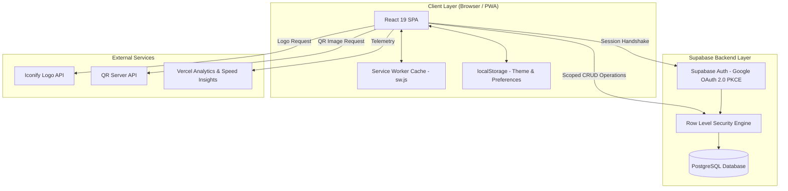

# ClickZ

**Live Website:** https://click-z.vercel.app/

<div align="center">
  
  <p><strong>A fast, minimalist, and secure bookmark and personal link management platform.</strong></p>

  <p>
    <a href="https://click-z.vercel.app/"></a>
    <a href="https://react.dev/"></a>
    <a href="https://vitejs.dev/"></a>
    <a href="https://supabase.com/"></a>
    <a href="https://developer.mozilla.org/en-US/docs/Web/Progressive_web_apps"></a>
    
  </p>

  <p>
    <a href="https://click-z.vercel.app/"><strong>Explore Live App</strong></a> •
    <a href="https://github.com/subha-3128/ClickZ/issues"><strong>Report Issue</strong></a> •
    <a href="https://www.linkedin.com/in/subhajit-bepari/"><strong>Connect on LinkedIn</strong></a>
  </p>
</div>

---

## 1. Project Overview

**ClickZ** is a modern, responsive personal link management web application designed to eliminate bookmark clutter and make daily web navigation instantaneous.

### The Problem It Solves
Web browsers have native bookmark bars, but they quickly turn into unorganized collections of stale URLs, cannot easily be shared or opened as QR codes, lack uniform visual identity across devices, and require multiple clicks to search or manage.

ClickZ solves this by providing a unified, cloud-synchronized dashboard where you can store, edit, and access all your essential destinations with:
- Zero visual clutter and an ultra-clean UI.
- Instant search filtering without round-trip network delays.
- Dynamic domain icon detection and QR code generation on the fly.
- Strict data isolation so each user only ever accesses their own links.

### Who It Is For
- **Developers & Engineers**: Quick access to documentation, cloud consoles, repositories, and staging URLs.
- **Content Creators & Designers**: Central repository for portfolios, reference material, and social profiles.
- **Productivity Enthusiasts**: Anyone looking for a fast, keyboard-first home screen that syncs across desktop and mobile browsers.

### How It Works
Users authenticate with Google OAuth via Supabase Auth (PKCE flow). All link records are stored securely in a PostgreSQL database with Row Level Security (RLS) enforcement. In the frontend, React 19 handles fast client-side rendering, instant in-memory search matching, responsive layout controls, and Progressive Web App (PWA) caching for reliable offline accessibility.

---

## 2. Key Features

- **One-Click Google OAuth**: Seamless, passwordless authentication powered by Supabase Auth with PKCE verification and automated session persistence.
- **Zero-Latency Search**: Real-time client-side fuzzy filtering across link titles, `@handles`, and destination URLs with instant results as you type.
- **Smart Logo Discovery**: Auto-detects domain brands and fetches high-resolution SVG logos through the Iconify API, falling back to clean initialed avatar badges when unavailable.
- **Dynamic QR Code Generator**: Generates clean, scannable QR codes for any saved link via QR Server API, complete with one-click direct PNG download and direct URL preview.
- **Intelligent URL Auto-Fill**: Paste any valid URL into the creation modal; ClickZ automatically parses the domain to pre-populate title text and generate a clean handle slug.
- **One-Click Clipboard Copying**: Click any link card to copy its URL directly to your clipboard, accompanied by an animated checkmark state and floating toast notification.
- **Keyboard-First Shortcuts**:
  - `Cmd+K` or `/` : Jump directly into the search bar.
  - `N` : Open the New Link modal from anywhere.
  - `Escape` : Clear search query or close active modals.
- **Safe CRUD Operations**: Add, view, edit title/handle/URL, open in a new tab, and delete links with double-check confirmation safeguards.
- **Dual Theme Architecture**: Carefully curated Dark and Light modes using modern zinc-foundation CSS variables, with local storage persistence and system preference synchronization.
- **PWA & Offline Support**: Custom Service Worker (`sw.js`) implementation with cache-first and runtime caching strategies, installable on mobile and desktop platforms.
- **Performance & Analytics**: Integrated `@vercel/speed-insights` and `@vercel/analytics` for core web vitals and interaction telemetry.

---

## 3. Tech Stack

| Domain | Technology | Purpose / Details |
| :--- | :--- | :--- |
| **Frontend Framework** | [React 19](https://react.dev/) (`19.2.5`) | Core UI library, component state management, hooks |
| **Build Tool & Server** | [Vite 8](https://vitejs.dev/) (`8.0.9`) | Lightning-fast HMR, optimized production asset bundling |
| **Styling** | Vanilla CSS (CSS Variables) | Modern Zinc design tokens, fluid transitions, and responsive grid layouts |
| **Backend & Database** | [Supabase](https://supabase.com/) | Hosted PostgreSQL with Row Level Security (RLS) |
| **Authentication** | Supabase Auth | Google OAuth 2.0 with PKCE authorization flow |
| **Icons & Brand Logos** | [Iconify API](https://iconify.design/) + Custom SVGs | Automated brand logo resolution (`logos:{slug}-icon.svg`) |
| **QR Code Engine** | [QR Server API](https://goqr.me/api/) | Dynamic on-the-fly QR code generation and PNG export |
| **Offline & PWA** | Service Worker API + Web App Manifest | Static asset caching (`clickz-cache-v1`), offline shell, installability |
| **Asset Generation** | [Sharp](https://sharp.pixelplumbing.com/) (`0.34.5`) | Automated script generation for multi-size PWA icons from SVG |
| **Analytics & Telemetry** | [Vercel Speed Insights](https://vercel.com/analytics) & Analytics | Real-user performance tracking and page engagement metrics |
| **Deployment** | [Vercel](https://vercel.com/) | Global Edge network hosting with automated Git-driven CI/CD |

---

## 4. How It Works

```
 ┌────────────────┐         Google OAuth          ┌───────────────────┐
 │   User Visit   │ ────────────────────────────> │   Supabase Auth   │
 └────────────────┘                               └───────────────────┘
         │                                                  │
         │ Authenticated Session                            ▼
         ▼                                        ┌───────────────────┐
 ┌────────────────┐       Fetch Links via RLS     │  PostgreSQL (DB)  │
 │  App Dashboard │ <───────────────────────────> │  (public.links)   │
 └────────────────┘                               └───────────────────┘
         │
         ├─► [Cmd+K or /] Instant In-Memory Search (title / handle / url)
         ├─► [N] New Link Modal ──> Smart URL Parse & Live Preview
         ├─► [Card Click] Copies link to clipboard + Toast confirmation
         ├─► [QR Modal] Fetches QR Code from QR Server API + PNG Download
         └─► [Theme Toggle] Switches Zinc Dark <-> Clean Light mode
```

1. **Authentication**: When an unauthenticated visitor lands on ClickZ, the `LoginScreen` presents a one-click Google Sign-in button. Initiating login redirects to Google OAuth via Supabase with PKCE verification. Upon callback, the session token is securely restored and persisted.
2. **Data Hydration**: `App.jsx` checks for an active session. If authenticated, it triggers `fetchLinks()`, querying the `public.links` table ordered by `created_at desc`. Skeleton cards display while the query completes.
3. **Adding a Link**: When opening the "New Link" modal, pasting a destination URL triggers an automated parser that extracts the domain name to suggest a Title and custom handle (e.g. `https://github.com/subha-3128` suggests "Github" with handle `github-subha-3128`). A live preview card updates in real time.
4. **Card Presentation & Brand Icons**: Each card uses candidate slug generation (`getAutoLogoCandidates`) against the Iconify API. If an official logo SVG is found, it renders in the card emblem; otherwise, the component gracefully falls back to two-letter initials.
5. **Quick Interaction**: Clicking any link card copies the URL to the clipboard with an animated confirmation badge and toast alert. A contextual menu on desktop and a mobile-friendly 3-dot dropdown provide options to display the QR code, visit the URL in a new tab, edit the link data, or delete the record with confirmation.
6. **QR Code Sharing**: Clicking "QR Code" opens an overlay dialog requesting an image from `api.qrserver.com`. Users can inspect the QR code, open the destination URL, or trigger a direct blob-based PNG download.

---

## 5. Architecture

ClickZ follows a clean, single-page application (SPA) client-side architecture backed by Supabase Serverless BaaS (Backend-as-a-Service) and micro-utility APIs.



---

## 6. Project Structure

```
ClickZ/
├── public/
│   ├── favicon.svg            # Primary SVG vector icon & PWA generation source
│   ├── manifest.webmanifest   # PWA manifest metadata and standalone display config
│   ├── og-image.png           # 1200x630 OpenGraph social share card
│   ├── pwa-192.png            # 192x192 PNG application icon
│   ├── pwa-512.png            # 512x512 PNG application icon
│   ├── pwa-512-maskable.png   # 512x512 maskable PNG icon for Android adaptive launchers
│   ├── robots.txt             # Search engine crawling rules
│   ├── sitemap.xml            # Search engine XML sitemap
│   └── sw.js                  # Service Worker for cache-first and runtime offline support
├── scripts/
│   └── generate-icons.js      # Utility script using Sharp to render PWA PNGs from SVG
├── src/
│   ├── components/
│   │   ├── auth/              # Authentication view & Google login CTA
│   │   │   ├── LoginScreen.jsx
│   │   │   ├── LoginScreen.css
│   │   │   └── index.js
│   │   ├── layout/            # Application header, theme toggle & user profile dropdown
│   │   │   ├── Header.jsx
│   │   │   ├── Header.css
│   │   │   └── index.js
│   │   ├── links/             # Link display cards, creation/editing modals & skeletons
│   │   │   ├── LinkCard.jsx
│   │   │   ├── LinkCard.css
│   │   │   ├── LinkForm.jsx
│   │   │   ├── LinkForm.css
│   │   │   ├── SkeletonList.jsx
│   │   │   ├── SkeletonList.css
│   │   │   └── index.js
│   │   ├── ui/                # Reusable UI primitives (QR modal, toasts, empty state, icons)
│   │   │   ├── EmptyState.jsx
│   │   │   ├── EmptyState.css
│   │   │   ├── Icons.jsx
│   │   │   ├── QrModal.jsx
│   │   │   ├── QrModal.css
│   │   │   ├── Toast.jsx
│   │   │   ├── Toast.css
│   │   │   └── index.js
│   │   └── index.js           # Master component barrel export
│   ├── lib/
│   │   ├── supabase.js        # Supabase JS client configuration with PKCE flow
│   │   └── index.js           # Library module barrel export
│   ├── utils/
│   │   ├── helpers.js         # Slug generation, URL validation, auto-logo candidate resolvers
│   │   └── index.js           # Utility module barrel export
│   ├── App.jsx                # Main application orchestrator, state manager & shortcut listener
│   ├── App.css                # Color tokens, layout primitives, and component utilities
│   ├── index.css              # Global resets, typography tokens & keyframe animations
│   └── main.jsx               # React 19 root entry point & Service Worker registration
├── supabase/
│   ├── migrations/            # SQL migration timestamp files
│   ├── config.toml            # Supabase local configuration
│   └── schema.sql             # Complete database schema, RLS policies, indexes & storage
├── .env.example               # Safe environment variable template with placeholder keys
├── eslint.config.js           # ESLint 9 configuration with React hooks rules
├── index.html                 # HTML5 document shell with SEO meta tags & Schema.org JSON-LD
├── package.json               # Dependencies, scripts, and package metadata
└── vite.config.js             # Vite 8 configuration with React plugin
```

---

## 7. Installation & Setup

### Prerequisites
- **Node.js**: Version 18.0 or higher
- **npm**: Version 9.0 or higher (or `pnpm` / `yarn`)
- **Supabase Account**: A free Supabase project with Google OAuth credentials configured in the Authentication settings.

### 1. Clone the Repository
```bash
git clone https://github.com/subha-3128/ClickZ.git
cd ClickZ
```

### 2. Install Dependencies
```bash
npm install
```

### 3. Configure Environment Variables
Create a `.env` file in the root directory:
```bash
cp .env.example .env   # Or create a new .env file
```

Populate the file with your Supabase credentials:
```env
VITE_SUPABASE_URL=https://your-project-id.supabase.co
VITE_SUPABASE_ANON_KEY=your-supabase-anon-public-key
```

> **Note:** Never commit production keys or service role secrets. `VITE_SUPABASE_ANON_KEY` is a client-safe public anonymous key intended for browser use under Row Level Security.

### 4. Database Setup
In your Supabase project's **SQL Editor**, run the contents of [`supabase/schema.sql`](supabase/schema.sql) to create:
- The `public.links` table with UUID generation.
- Indexes on `(user_id, created_at desc)`.
- Row Level Security (RLS) policies for select, insert, update, and delete actions.
- The optional `link-logos` storage bucket with user folder policies.

### 5. Run the Local Development Server
```bash
npm run dev
```
Open your browser at `http://localhost:5173`.

### 6. Production Build & Verification
```bash
# Build the production bundle
npm run build

# Preview the production build locally
npm run preview

# Run the linter
npm run lint
```

*(Optional)* To regenerate PWA icon assets from `public/favicon.svg`:
```bash
npm run generate:icons
```

---

## 8. Usage

### Signing In
1. Open the website or local dev server.
2. Click **"Continue with Google"** on the welcome portal.
3. Choose your Google account. You will be redirected straight into your private dashboard.

### Adding & Managing Links
- **Create a Link**: Click the **"+ New Link"** button in the header or press `N` on your keyboard. Paste a destination URL; the title and handle slug will auto-populate. Review the live preview card and click **"Create Link"**.
- **Search Links**: Press `Cmd+K` (Mac), `Ctrl+K` (Windows/Linux), or `/` to immediately focus the search input. Results update in real time.
- **Copy Link**: Click directly on the link card's main surface to copy the URL to your clipboard.
- **Generate QR Code**: Click the options icon (desktop toolbar or mobile 3-dot menu) and select **"QR Code"**. From the modal, you can preview the code or click **"Download Image"** to save it as a PNG.
- **Edit or Delete**: Select **"Edit"** to adjust title, handle, or URL in-place, or select **"Delete"** and confirm to permanently remove the bookmark.

### Keyboard Shortcuts Reference

| Shortcut | Context | Action |
| :--- | :--- | :--- |
| `Cmd+K` or `Ctrl+K` | Global | Focus search input |
| `/` | Global (when not typing) | Focus search input |
| `N` | Global (when not typing) | Open New Link modal |
| `Escape` | Inside Search | Blur search input and clear query |
| `Escape` | Inside Modal / Overlay | Close active modal (New/Edit Link or QR dialog) |

---

## 9. API & Database

### Database Schema (`public.links`)

```sql
create table public.links (
  id uuid primary key default gen_random_uuid(),
  user_id uuid not null references auth.users(id) on delete cascade,
  name text not null,
  custom_id text not null,
  link text not null,
  logo_url text,
  created_at timestamptz not null default now()
);
```

#### Indexes
- `links_user_id_created_at_idx` ON `public.links (user_id, created_at desc)`: Ensures instant link retrieval sorted chronologically per user.

#### Row Level Security (RLS) Policies
Data privacy is enforced at the PostgreSQL engine level:
- **SELECT**: Restricted to `auth.uid() = user_id`
- **INSERT**: Enforced `with check (auth.uid() = user_id)`
- **UPDATE**: Enforced `using (auth.uid() = user_id) with check (auth.uid() = user_id)`
- **DELETE**: Restricted to `auth.uid() = user_id`

### External Micro-APIs
- **Iconify API**: `https://api.iconify.design/logos:{slug}-icon.svg`
  - Used for deterministic domain and brand emblem resolution based on custom handles and domain hostnames.
- **QR Server API**: `https://api.qrserver.com/v1/create-qr-code/?size=280x280&margin=12&data={url}`
  - Used for dynamic client-side QR code image generation.

---

## 10. Deployment

ClickZ is deployed on **Vercel** with continuous deployment integrated directly into the `main` branch of this repository.

- **Platform**: Vercel
- **Framework Preset**: Vite
- **Build Command**: `npm run build`
- **Output Directory**: `dist`
- **Environment Variables**:
  - `VITE_SUPABASE_URL`
  - `VITE_SUPABASE_ANON_KEY`
- **Redirects / OAuth Whitelist**: The production origin (`https://click-z.vercel.app`) and local development origin (`http://localhost:5173`) are registered under Supabase Authentication Redirect URLs.

---

## 11. Future Improvements

The following features represent realistic enhancements planned for future versions:

- [ ] **Tag & Collection Organization**: Group links by project, workspace, or custom tags (e.g. Work, Personal, Docs).
- [ ] **Browser Extensions**: Official Chrome and Firefox extensions for one-click bookmarking of active tabs.
- [ ] **Data Import & Export**: Import existing browser bookmarks via HTML and export saved links to JSON or CSV formats.
- [ ] **Manual Reordering**: Drag-and-drop link reordering and custom pinning for most-frequently accessed links.
- [ ] **Click Analytics & Counters**: Optional privacy-friendly click counters to highlight most frequently accessed resources.
- [ ] **Custom Logo Upload UI**: Enable users to upload bespoke icons directly to the configured `link-logos` Supabase storage bucket.
- [ ] **Public Profile Page**: Optional public shareable profile page (e.g., `click-z.vercel.app/u/@username`) for personal link-in-bio sharing.

---

## 12. License & Author

### Author
**Subhajit Bepari**
- **GitHub**: [@subha-3128](https://github.com/subha-3128)
- **LinkedIn**: [Subhajit Bepari](https://www.linkedin.com/in/subhajit-bepari/)
- **Project Repository**: [subha-3128/ClickZ](https://github.com/subha-3128/ClickZ)

### License
This project is open source and available under the [MIT License](LICENSE).
